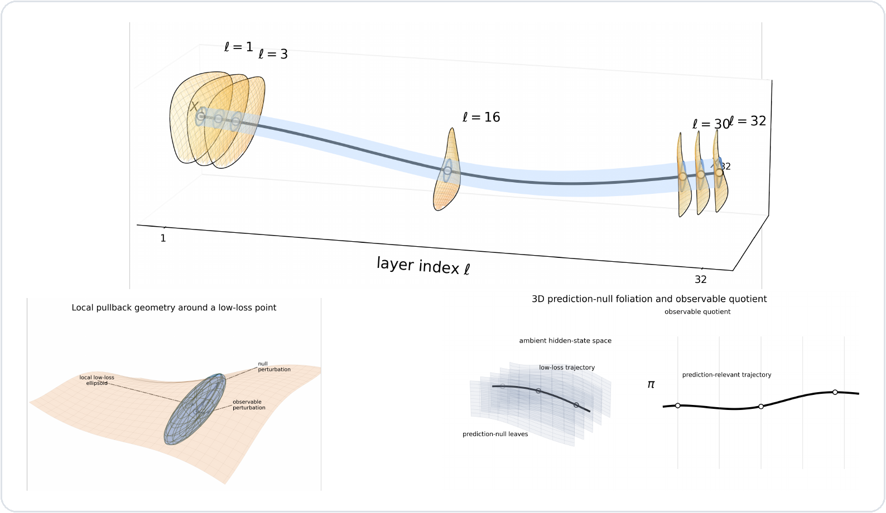
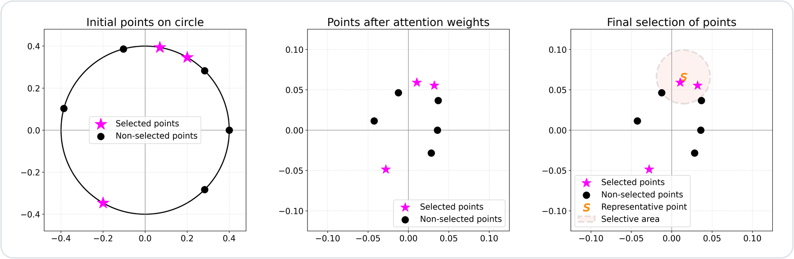
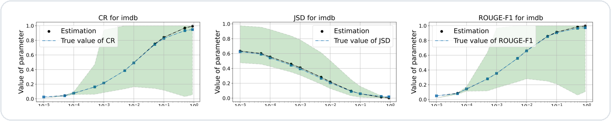
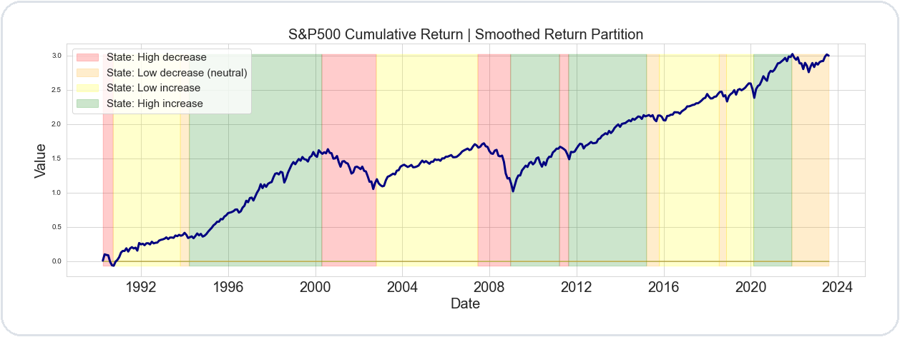
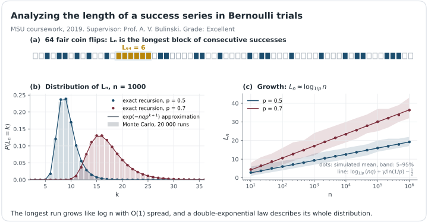
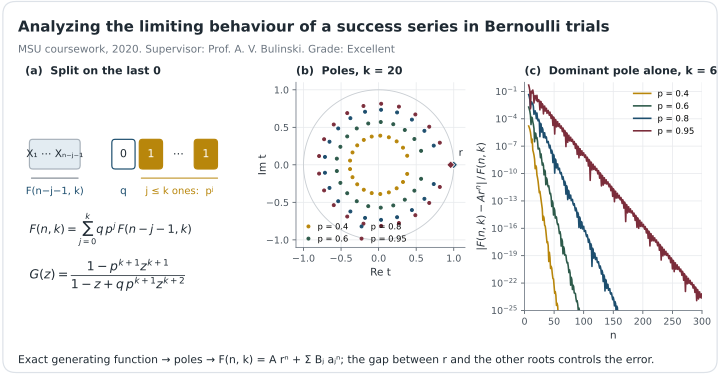
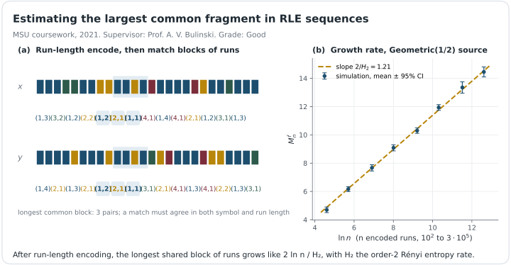
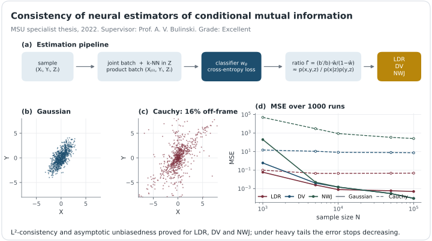

<h1 align="center">Timur Mudarisov</h1>

  <strong>Machine Learning Researcher · Transformers · LLMs · Quantitative ML</strong> 
  Doctoral Researcher at SnT, University of Luxembourg

  
  
  
  

I study the mathematical and empirical structure of **Transformers and large language models**, with a focus on attention, hidden-state geometry, residual dynamics, model compression, and efficient inference. My background combines **machine learning, probability theory, economics, and quantitative research**.

## Publications

Click a paper to see what it is about, with a figure from the paper.

&nbsp; <b>Predictive Geometry of Hidden Trajectories in Transformers</b> · <i>accepted</i>

<i>Figure 1 from the paper: a hidden-state trajectory with layerwise low-loss sets (top), the local pullback geometry around a low-loss point (bottom left), and prediction-null leaves with the observable quotient (bottom right).</i>

A decoder-only transformer is trained only through its final next-token loss, yet that loss constrains every intermediate hidden state. Around trajectories where the model already predicts well, the local curvature of the loss-to-go is a pullback Fisher operator: it splits hidden space into a few output-sensitive directions and many almost prediction-null ones, and gives a tokenwise sensitivity score. Across 1B–9B LLMs this geometry predicts perturbation sensitivity, guides layerwise rank allocation and token pruning, and improves low-rank student distillation on top of reverse and skew KL. [Code](https://github.com/timmurk/Predictive-Geometry-of-Hidden-Trajectories-in-Transformers)

&nbsp; <b>Limitations of Normalization in Attention Mechanism</b>

<i>Figure 1 from the paper: token embeddings on a circle are rescaled by their attention weights; only selected tokens that stay inside the ball around the context vector s remain distinguishable.</i>

Why softmax attention loses focus on long contexts. For any normaliser that does not depend on the context length, attention weights shrink like 1/L; the paper bounds the distance between selected and ignored tokens, shows that only about 80% of the selected tokens can be geometrically separated, and bounds the Jacobian, which grows as the temperature drops. Experiments on GPT-2 confirm all three effects. [arXiv](https://arxiv.org/abs/2508.17821)

&nbsp; <b>Scalable Text Vectorization with Hyperdimensional Computing Through Selective Word Encoding</b>

<i>Figure 3 from the paper (top row): compression rate, Jensen–Shannon divergence and ROUGE-F1 on IMDB against the quantile p; theoretical estimators versus true values, with bounds shaded.</i>

Hyperdimensional computing encodes text as long ±1 vectors, but large vocabularies make it expensive. Compression HDC first keeps only the most informative words (TF-IDF or LDA) and then encodes. The paper derives estimators and bounds for the compression rate, Jensen–Shannon divergence and ROUGE, and a Chernoff-type bound for how well documents stay distinguishable; experiments on IMDB, AG News and arXiv match the theory.

&nbsp; <b>Cross-Sector Market Regime Forecasting with LLM-Augmented News Analysis</b>

<i>Figure 2 from the paper: S&P 500 cumulative return, 1990–2024, split into four return-based market regimes.</i>

Can financial news predict the next market regime? Regimes of the S&P 500 are labelled by return- and volatility-based partitions, and a model combining a time-series network with a chain of FinBERT models (news selection, market-mover scoring, regime probabilities) forecasts next month's regime. Adding news improves accuracy by up to 73% and weighted F1 by up to 110% over the time-series model alone. [DOI](https://doi.org/10.1145/3677052.3698642)

## Education & academic path

My training started in **probability theory and mathematical statistics**, then expanded into **economics, machine learning, reinforcement learning, and quantitative finance**, and eventually into my current work on the mathematical structure of Transformers.

<table>
<tr>
<td width="80" align="center"></td>
<td>
<strong>University of Luxembourg — SnT</strong> 
Doctoral Researcher / PhD · 2024–present · Luxembourg  
My PhD studies Transformers as high-dimensional compositional operator systems, focusing on attention geometry, residual-stream dynamics, hidden-state trajectories, and prediction-relevant directions. This work has led to papers at <strong>NeurIPS 2025</strong> and <strong>NeurIPS 2026</strong>.
</td>
</tr>
<tr>
<td width="80" align="center">  </td>
<td>
<strong>New Economic School + Yandex School of Data Analysis</strong> 
Economics & Data Science · 2020–2022 · Moscow  
A joint program combining graduate-level economics with a rigorous data-science curriculum. <strong>NES GPA: 4.2/5.0.</strong> At YSDA, I received <strong>Excellent</strong> grades in Python, Fundamentals of Statistics for ML, Machine Learning I, Functional Analysis, and Reinforcement Learning.  
<strong>Capstone:</strong> <a href="https://github.com/timmurk/Utility-based-market-making">Utility-based approach for HFT market making</a> — a market-making environment with utility-based rewards, an Avellaneda–Stoikov baseline, and a DQN-style reinforcement-learning agent for inventory-aware quoting.
</td>
</tr>
<tr>
<td width="80" align="center"></td>
<td>
<strong>Lomonosov Moscow State University — Faculty of Mechanics and Mathematics</strong> 
Specialist degree · Department of Probability Theory · 2016–2022 · Moscow  
Six-year mathematical training with a focus on probability, stochastic processes, mathematical statistics, time series, stochastic calculus in finance, and machine learning. <strong>GPA: 4.5/5.0.</strong> My specialist thesis was graded <strong>Excellent</strong>.  
My academic supervisor was <a href="https://new.math.msu.su/department/probab/staff/bulinsk.html"><strong>Prof. Alexander V. Bulinski</strong></a>, a probability theorist and a student of <strong>A. N. Kolmogorov</strong>. Under his supervision, I worked on a sequence of research projects moving from classical probability and asymptotics toward information theory and neural estimation.
</td>
</tr>
</table>

### Selected undergraduate research at MSU

Click a title to open the figure and a short summary.

<b>Analyzing the Length of a Success Series in Bernoulli Trials</b> · 2019 · <i>Excellent</i>

How long is the longest streak of heads in n coin flips? The work derives exact and recursive formulas for its distribution, shows that it grows like log n with bounded spread, and checks the double-exponential approximation against simulations. [PDF](papers/2019_longest_runs_bernoulli.pdf)

<b>Analyzing the Limiting Behaviour of a Success Series in Bernoulli Trials</b> · 2020 · <i>Excellent</i>

The same problem through generating functions: conditioning on the last zero gives a linear recurrence, the recurrence gives a rational generating function, and its poles give an explicit formula F(n, k) = A rⁿ + Σ Bⱼ aⱼⁿ for the distribution of the longest run. [PDF](papers/2020_limiting_behavior_bernoulli_runs.pdf)

<b>Estimating the Largest Common Fragment in RLE Sequences</b> · 2021 · <i>Good</i>

Two random sequences are compressed with run-length encoding. How long is the longest block of runs they share? For processes with countable support and strong exponential mixing it grows like 2 log n / H₂, where H₂ is the order-2 Rényi entropy rate of the encoded process. [PDF](papers/2021_rle_common_fragment.pdf)

<b>Statistical Evaluation of Conditional Mutual Information by Neural Networks</b> · 2022, specialist thesis · <i>Excellent</i>

Classifier-based neural estimators of conditional mutual information (LDR, DV, NWJ). The thesis proves their $L^2$-consistency and asymptotic unbiasedness, and shows in simulations that on heavy-tailed (Cauchy) data their error stops decreasing. [PDF](papers/2022_neural_cmi_estimators_thesis.pdf)

### NES + YSDA capstone: reinforcement learning for market making

The final project explored **inventory-aware market making in cryptocurrency markets**. The code implements an environment with utility-based rewards, an Avellaneda–Stoikov-style baseline, and a DQN agent, with the objective of balancing end-of-day P&L against inventory/liquidity risk.

  
  

  <a href="https://github.com/timmurk/Utility-based-market-making"><strong>Code and project repository →</strong></a>

## Experience

| | Role | Period |
|:--|:--|:--|
| **Raiffeisen Bank** | Model Validation / Machine Learning | 2022–2024 |
| **WorldQuant** | Quantitative Research Intern | 2021 |

## Open to

`Research Scientist` `Applied Scientist` `Research Engineer` `Quant ML Research`

Happy to talk about Transformer theory, efficient inference, and ML in finance. The fastest way to reach me is [LinkedIn](https://www.linkedin.com/in/timur-mudarisov-a675a01b4/).

  Luxembourg · Transformers · LLMs · Statistical Learning · Quantitative ML

