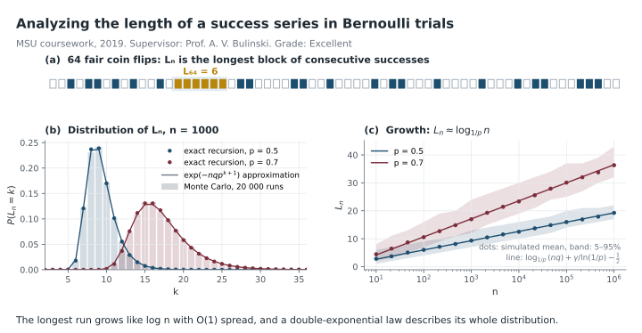
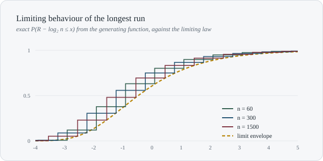
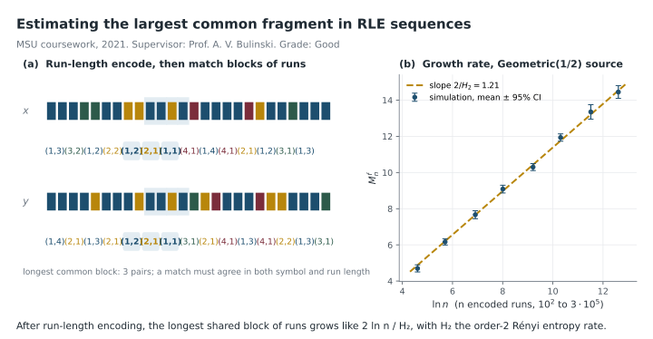
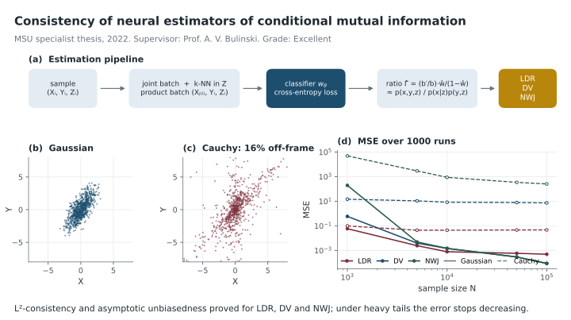

<h1 align="center">Timur Mudarisov</h1>

  <strong>Machine Learning Researcher · Transformers · LLMs · Quantitative ML</strong> 
  Doctoral Researcher at SnT, University of Luxembourg

  <a href="https://scholar.google.lu/citations?user=_oB9VgIAAAAJ&hl=en">Google Scholar</a>
  ·
  <a href="https://www.linkedin.com/in/timur-mudarisov-a675a01b4/">LinkedIn</a>
  ·
  <a href="https://orcid.org/0009-0006-4152-2544">ORCID</a>

I study the mathematical and empirical structure of **Transformers and large language models**, with a focus on attention, hidden-state geometry, residual dynamics, model compression, and efficient inference. My background combines **machine learning, probability theory, economics, and quantitative research**.

### Highlights

- **NeurIPS 2026 — accepted:** *Predictive Geometry of Hidden Trajectories in Transformers*
- **NeurIPS 2025:** *Limitations of Normalization in Attention Mechanism*
- **ICNLSP 2025:** *Scalable Text Vectorization with Hyperdimensional Computing Through Selective Word Encoding*
- **ACM ICAIF 2024:** *Cross-Sector Market Regime Forecasting with LLM-Augmented News Analysis*

## Education & academic path

My training started in **probability theory and mathematical statistics**, then expanded into **economics, machine learning, reinforcement learning, and quantitative finance**, and eventually into my current work on the mathematical structure of Transformers.

<table>
<tr>
<td width="72" align="center"></td>
<td>
<strong>University of Luxembourg — SnT</strong> 
Doctoral Researcher / PhD · 2024–present · Luxembourg  
My PhD studies Transformers as high-dimensional compositional operator systems, focusing on attention geometry, residual-stream dynamics, hidden-state trajectories, and prediction-relevant directions. This work has led to papers at <strong>NeurIPS 2025</strong> and <strong>NeurIPS 2026</strong>.
</td>
</tr>
<tr>
<td width="72" align="center"> </td>
<td>
<strong>New Economic School + Yandex School of Data Analysis</strong> 
Economics & Data Science · 2020–2022 · Moscow  
A joint program combining graduate-level economics with a rigorous data-science curriculum. <strong>NES GPA: 4.2/5.0.</strong> At YSDA, I received <strong>Excellent</strong> grades in Python, Fundamentals of Statistics for ML, Machine Learning I, Functional Analysis, and Reinforcement Learning.  
<strong>Capstone:</strong> <a href="https://github.com/timmurk/Utility-based-market-making">Utility-based approach for HFT market making</a> — a market-making environment with utility-based rewards, an Avellaneda–Stoikov baseline, and a DQN-style reinforcement-learning agent for inventory-aware quoting.
</td>
</tr>
<tr>
<td width="72" align="center"></td>
<td>
<strong>Lomonosov Moscow State University — Faculty of Mechanics and Mathematics</strong> 
Specialist degree · Department of Probability Theory · 2016–2022 · Moscow  
Six-year mathematical training with a focus on probability, stochastic processes, mathematical statistics, time series, stochastic calculus in finance, and machine learning. <strong>GPA: 4.5/5.0.</strong> My specialist thesis was graded <strong>Excellent</strong>.  
My academic supervisor was <a href="https://new.math.msu.su/department/probab/staff/bulinsk.html"><strong>Prof. Alexander V. Bulinski</strong></a>, a probability theorist and a student of <strong>A. N. Kolmogorov</strong>. Under his supervision, I worked on a sequence of research projects moving from classical probability and asymptotics toward information theory and neural estimation.
</td>
</tr>
</table>

### Selected undergraduate research at MSU

<table>
<tr>
<td width="50%" valign="top">

**Analyzing the Length of a Success Series in Bernoulli Trials** · 2019 · **Excellent**  
Studied the distribution and asymptotic behaviour of the longest run in Bernoulli trials, including exact / recursive formulas and Python simulations.  
[PDF](papers/2019_longest_runs_bernoulli.pdf)
</td>
<td width="50%" valign="top">

**Analyzing the Limiting Behaviour of a Success Series in Bernoulli Trials** · 2020 · **Excellent**  
Developed a generating-function approach to the same family of extreme-run problems, using roots of the generating function and explicit distributional analysis to study limiting behaviour.  
[PDF](papers/2020_limiting_behavior_bernoulli_runs.pdf)
</td>
</tr>
<tr>
<td width="50%" valign="top">

**Estimating the Largest Common Fragment in RLE Sequences** · 2021 · **Good**  
Studied asymptotics of the longest common substring after Run-Length Encoding for stochastic processes with countable support, connecting the limit to order-2 Rényi entropy under strong exponential mixing.  
[PDF](papers/2021_rle_common_fragment.pdf)
</td>
<td width="50%" valign="top">

**Statistical Evaluation of Conditional Mutual Information by Neural Networks** · Specialist thesis · 2022 · **Excellent**  
Studied classifier-based neural estimators of conditional mutual information, with emphasis on asymptotic normality, \(L^2\)-consistency, and numerical stress tests on heavy-tailed distributions.  
[PDF](papers/2022_neural_cmi_estimators_thesis.pdf)
</td>
</tr>
</table>

### NES + YSDA capstone: reinforcement learning for market making

The final project explored **inventory-aware market making in cryptocurrency markets**. The code implements an environment with utility-based rewards, an Avellaneda–Stoikov-style baseline, and a DQN agent, with the objective of balancing end-of-day P&L against inventory/liquidity risk.

  
  

  <a href="https://github.com/timmurk/Utility-based-market-making"><strong>Code and project repository →</strong></a>

## Selected experience

**Raiffeisen Bank** — Model Validation / Machine Learning · 2022–2024  
**WorldQuant** — Quantitative Research Intern · 2021

## Featured research

[**Predictive Geometry of Hidden Trajectories in Transformers**](https://github.com/timmurk/Predictive-Geometry-of-Hidden-Trajectories-in-Transformers)

NeurIPS 2026 work on prediction-relevant hidden-state geometry, Fisher-based sensitivity, compression, pruning, and distillation.

## Current interests

`Applied Scientist` · `Research Scientist` · `Research Engineer` · `Quant ML Research`

  Luxembourg · Transformers · LLMs · Statistical Learning · Quantitative ML

